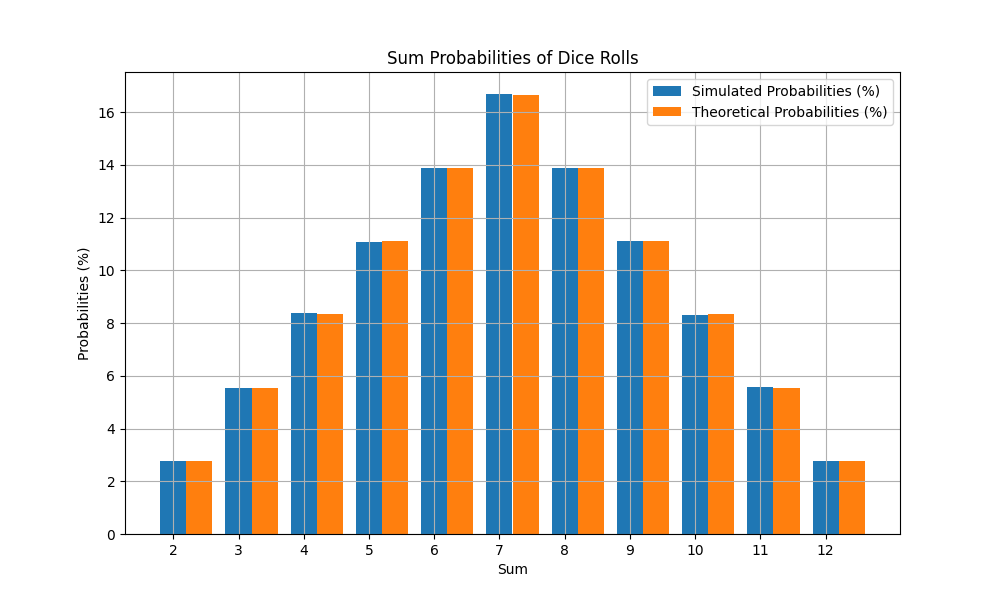

# GoIT Algorithm Course Final Project

## 1. Install
### 1.1. Clone repository
```bash
git clone https://github.com/Swingyboy/goit-algo-fp.git
```
### 1.2. Install requirements
```bash
pip install -r requirements.txt
```


## 2. Tasks description

### Task 1
Created LinkedList class that supports the following operations:
 - `append` - adds a new element to the end of the list
 - `delete` - removes the first occurrence of the element from the list
 - `to_list` - returns a list of all elements in the linked list
 - `from_list` - creates a linked list from a list of elements
 - `print_list` - prints all elements in the linked list
 - `reverse`- reverses the linked list
 - `merge` - merges two linked lists into one
 - `merge_sort` - sorts the linked list using the merge sort algorithm
 - `split_list` - splits the linked list into two halves

### Task 2
Created a draw pythagoras tree function that draws a pythagoras tree using the turtle module.
If the file is run as a script, the function will draw a pythagoras tree with the following parameters:
 - `depth` - the depth of the tree

### Task 3
Implemented a `Graph` class that supports the following operations:
 - `add_edge` - adds an edge between two vertices
 - `add_vertex` - adds a vertex to the graph
 - `delete_edge` - removes an edge between two vertices
 - `delete_vertex` - removes a vertex from the graph
 - `from_dict` - creates a graph from a dictionary
 - `to_dict` - returns a dictionary representation of the graph
 - `dijkstra` - finds the shortest path between two vertices using Dijkstra's algorithm. This method include binary heap implementation (heapq module)

### Task 4
Implemented `insert_to_heap` and `build_heap` functions these allow to create binary heap from specified list.
If the file is run as a script, the function will create a binary heap from the list and print it.
It accepts the folowing parameters:
 - `--max_heap` - bool, if True, creates a max heap, otherwise creates a min heap
 - `elements` -  list of elements to create a heap from

### Task 5
Implemented a visualisation of the BFS and DFS algorithms. The visualisation is done using RGB colors. The algorithm is visualised by changing the color of the pixel at the current position. The color of the pixel is determined by the number of steps the algorithm has taken.
If the file is run as a script, the function will visualise the BFS or DFS algorithm with the following parameters:
 - `--algorithm` - the algorithm to visualise (BFS or DFS)
 - `--tree-type` - the type of tree to visualise (binary_search or heap)
 - `elemetns` - list of elements to create a tree from

### Task 6
Implemented greedy and dynamic programming algorithms for the knapsack problem.
If the file is run as a script, the function will solve the knapsack problem. It would wait for the user to enter the number of items and the capacity of the knapsack. Then it would wait for the user to enter the weight and value of each item and total budget. After that, it would print the maximum value that can be put into the knapsack for each algorithm.

### Task 7
This code simulates rolling two dice, calculates the probabilities, compares them to the theoretical values, and outputs the results as a table and a bar graph.

#### Table of probabilities

| Sum |  Simulated Probabilities (%) |  Theoretical Probabilities (%) |
|-----|-----------------------------:|-------------------------------:|
| 2   |                         2.81 |                           2.78 |
| 3   |                         5.58 |                           5.56 |
| 4   |                         8.35 |                           8.33 |
| 5   |                        11.07 |                          11.11 |
| 6   |                        13.92 |                          13.89 |
| 7   |                        16.63 |                          16.67 |
| 8   |                        13.95 |                          13.89 |
| 9   |                        11.06 |                          11.11 |
| 10  |                         8.34 |                           8.33 |
| 11  |                         5.53 |                           5.56 |
| 12  |                         2.77 |                           2.78 |

#### Bar graph of probabilities



#### Reasons for the difference between simulated and theoretical probabilities:

- **Randomness in simulation:** Simulation results will always have some deviations from theoretical values ​​due to the random nature of the process. Even with a large number of simulations (1,000,000 in this case), there is a possibility of small statistical fluctuations.
- **Number of simulations:** Although we have run 1,000,000 simulations, this is still a limited number. Increasing the number of simulations will further reduce the difference between simulated and theoretical probabilities.
- **Computational limitations:** Each simulation uses a random number generator that operates based on a specific algorithm. Although these generators are very good, they can still introduce small errors.

In general, the difference between simulated and theoretical probabilities is expected and normal. It confirms the correctness of the theoretical calculations and demonstrates that the simulation approach well approximates the theoretical values ​​of the probabilities.
